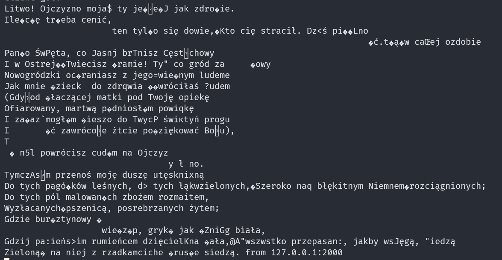

# Worst Protocol Ever
> PL only, sorry

Moja dziewczyna dostała takie zadanko na studiach:

Mamy dwóch klientów oraz serwer, komunikują się po UDP. Klient 1 wysyła wiadomość do serwera, a serwer przesyła ją do klienta 2. Serwer działa w trybie zakłóceń, ma 10% szans na zamienienie każdego bajtu wiadomości na losowy przed przesłaniem dalej.  


Musimy znaleźć sposób na przesłanie danych poprawnie pomimo tych zakłóceń wykorzystując różne techniki, takie jak:
- Sumy kontrolne
- Retransmisje oraz potwierdzenia
- Dzielenie informacji na mniejsze bloki
- Nadmiarowość

Jako ostateczny test musimy przesłać 50000 bajtów, a sam protokół ma być jak najefektywnieszy. Wykorzystamy prawie wszystkie te techniki, więc zaczynajmy!

## Przygotowanie
Przygotujmy sobie bazowy kod. Napiszę to wszystko w JavaScript z wykorzystaniem nodejs, gdyż jest to język, który dobrze znam. Ponadto będziemy mogli się lepiej skupić na samej implementacji protokołu, a kod będzie bardziej zwięzły.

Stworzymy sobie najpierw plik `server.mjs`, a w nim wklejamy kod z naszych założeń serwera:
```js
import dgram from 'node:dgram';
const server = dgram.createSocket('udp4');

const client1 = "127.0.0.1:1999";
const client2 = "127.0.0.1:2001";
const corruptionPropability = 0.1;

/**
 * 
 * @param {Buffer} data 
 */
function corruptData(data) {
    for (let i = 0; i < data.byteLength; i++) {
        const random = Math.random();
        if (random <= corruptionPropability) {
            const randomByte = Math.floor(Math.random() * 256);
            data.writeUint8(randomByte, i);
        }
    }
}

server.on('error', (err) => {
  console.error(`server error:\n${err.stack}`);
  server.close();
});

server.on('message', (msg, rinfo) => {
  console.log(`server got: ${msg} from ${rinfo.address}:${rinfo.port}`);
  let [targetHost, targetPort] = client1.split(':');
  if (`${rinfo.address}:${rinfo.port}` === client1) {
    [targetHost, targetPort] = client2.split(':');
  }
  corruptData(msg);

  server.send(msg, targetPort, targetHost);
});

server.on('listening', () => {
  const address = server.address();
  console.log(`server listening ${address.address}:${address.port}`);
});

server.bind(2000, "127.0.0.1");
```
Tego kodu nie będziemy modyfikować.

Następnie utwórzmy plik `wpsocket.mjs`, tutaj będzie kod naszego protokołu:
```js
import dgram from "node:dgram";

export class WPSocket {
    /**
     * 
     * @param {Buffer} msg 
     * @param {dgram.RemoteInfo} rinfo 
     */
    processMessage(msg, rinfo) {
        this.messageCallbacks.forEach(c => c(msg, rinfo));
    }

    /**
     * 
     * @param {Buffer} msg 
     * @param {number} targetPort 
     * @param {string} targetAddress 
     */
    send(msg, targetPort, targetAddress) {
        this.internalSocket.send(msg, targetPort, targetAddress);
    }
    
    internalSocket = dgram.createSocket('udp4');

    listeningCallbacks = [];
    messageCallbacks = [];
    errorCallbacks = [];

    constructor() {
        this.internalSocket.on('listening', () => {
            this.listeningCallbacks.forEach(c => c())
        });

        this.internalSocket.on('error', (err) => {
            this.errorCallbacks.forEach(c => c(err));
        });

        this.internalSocket.on('message', this.processMessage.bind(this));
    }

    /**
     * 
     * @param {string} host 
     * @param {number} port 
     */
    bind(port, host) {
        this.internalSocket.bind(port, host);
    }

    /**
     * 
     * @param {(msg: Buffer, rinfo: dgram.RemoteInfo) => void} callback 
     */
    onMessage(callback) {
        this.messageCallbacks.push(callback);
    }

    /**
     * 
     * @param {(err: any) => void} callback 
     */
    onError(callback) {
        this.errorCallbacks.push(callback);
    }

    /**
     * 
     * @param {() => void} callback 
     */
    onListening(callback) {
        this.listeningCallbacks.push(callback);
    }

    close() {
        this.internalSocket.close();
    }
}
```

Tak wiem, dużo się tu dzieje, nas jednak obchodzą jedynie metody `processMessage` oraz `send`. W `processMessage` będziemy przetwarzać odebraną z serwera uszkodzoną wiadomość, a w send będziemy kodować.

Teraz utwórzmy klientów, którzy wykorzystają nasz `WPSocket`, plik `client1.mjs`:
```js
import { WPSocket } from './wpsocket.mjs';
const client = new WPSocket();

const server = "127.0.0.1:2000";
const [serverHost, serverPort] = server.split(':');

client.onError((err) => {
  console.error(`server error:\n${err.stack}`);
  client.close();
});

client.onMessage((msg, rinfo) => {
  console.log(`Client got: ${msg} from ${rinfo.address}:${rinfo.port}`);
});

client.onListening(() => {
  const address = client.internalSocket.address();
  console.log(`client listening ${address.address}:${address.port}`);
});

client.bind(1999, "127.0.0.1");

const data = `
Litwo! Ojczyzno moja! ty jesteś jak zdrowie.
Ile cię trzeba cenić, ten tylko się dowie,
Kto cię stracił. Dziś piękność twą w całej ozdobie
Widzę i opisuję, bo tęsknię po tobie.
Panno Święta, co Jasnej bronisz Częstochowy
I w Ostrej świecisz Bramie! Ty, co gród zamkowy
Nowogródzki ochraniasz z jego wiernym ludem!
Jak mnie dziecko do zdrowia powróciłaś cudem
(Gdy od płaczącej matki pod Twoję opiekę
Ofiarowany, martwą podniosłem powiekę
I zaraz mogłem pieszo do Twych świątyń progu
Iść za wrócone życie podziękować Bogu),
Tak nas powrócisz cudem na Ojczyzny łono.
Tymczasem przenoś moję duszę utęsknioną
Do tych pagórków leśnych, do tych łąk zielonych,
Szeroko nad błękitnym Niemnem rozciągnionych;
Do tych pól malowanych zbożem rozmaitem,
Wyzłacanych pszenicą, posrebrzanych żytem;
Gdzie bursztynowy świerzop, gryka jak śnieg biała,
Gdzie panieńskim rumieńcem dzięcielina pała,
A wszystko przepasane, jakby wstęgą, miedzą
Zieloną, na niej z rzadka ciche grusze siedzą.`

client.send(data, serverPort, serverHost);
```

Oraz plik `client2.mjs`:
```js
import { WPSocket } from './wpsocket.mjs';
const client = new WPSocket();

client.onError((err) => {
  console.error(`server error:\n${err.stack}`);
  client.close();
});

client.onMessage((msg, rinfo) => {
  console.log(`Client got: ${msg} from ${rinfo.address}:${rinfo.port}`);
});

client.onListening(() => {
  const address = client.internalSocket.address();
  console.log(`client listening ${address.address}:${address.port}`);
});

client.bind(2001, "127.0.0.1");
```

Otwórzmy teraz 3 okna terminala, wpiszmy w dwóch pierwszych:
1. `node server.mjs`
2. `node client2.mjs`

Teraz za każdym razem jak w trzecim oknie wpiszemy `node client1.mjs` zostanie wysłana inwokacja z *Pana Tadeusza* Adama Mickiewicza do serwera, serwer uszkodzi ją i prześle do klienta 2.
Oto co otrzymujemy na drugim kliencie:

Naszym celem jest teraz zmodyfikowanie metod `processMessage` oraz `send` w klasie `WPSocket`, tak aby klient 2 dostał ładną, bezbłędną inwokację.


## Wykrywanie przekłamań
Żeby uznać pakiet za błędny musimy wiedzieć, że jest on błędny. Ludzkim okiem potrafimy ocenić, że wiadomość nie jest taka jaka być powinna, ale komputer musi mieć mechanizm do sprawdzenia tego.

Istnieją różne metody sprawdzenia czy wiadomość dotarła, może to być
- Sprawdzanie parzystości bitów
- Suma kontrolna
- CRC
- Hashe

Niestety nasze zakłócenia są dosyć wysokie, więc żadna metoda nie da nam 100% pewności, że wykryliśmy błąd. Ale hash da największe prawdopodobieństwo, więc to go użyję. Użyję w tym przypadku MD5. MD5 nie jest już kryptograficznie bezpieczną funkcją hashującą, ale do wykrycia błędu będzie całkowicie wystarczająca. Szansa na wygenerowanie 2 takich samych hashy wynosi 1.47*10^-29, więc można powiedzieć, że jest pomijalna.

Hash dodamy do początku wiadomości, MD5 ma 16 bajtów, więc pierwsze 16 bajtów wiadomości to będzie hash.

Nasza wysłana wiadomość będzie więc wyglądała tak:
```
|------------------------|
| 128 bit MD5 | Message  |
|------------------------|
```

Zaimplementujmy zatem hashowanie wiadomości i dodawanie hasha na jej początek. Dodajmy sobie funkcję w naszym pliku `wpsocket.mjs` o nazwie `addHashToMessage`, a w niej:
```js
function addHashToMessage(message) {
    const hash = crypto.createHash('md5').update(message).digest();
    return Buffer.concat([hash, message]);
}
```

A następnie wykorzystajmy tę funkcję do wysłania wiadomości, zmodyfikujmy metodę `send`:
```js
send(msg, targetPort, targetAddress) {
    // Musimy zamienić wiadomość na bufor, czyli reprezetację bajtową.
    // Gdyż za pomocą metody `addHashToMessage` wykonujemy operację na buforach.
    if (!(msg instanceof Buffer)) {
        msg = Buffer.from(msg);
    }
    const messageWithHash = addHashToMessage(msg);
    this.internalSocket.send(messageWithHash, targetPort, targetAddress);
}
```

Dodajmy funkcję weryfikującą poprawność pakietu o nazwie `verifyPacket`, której przekażemy hash oraz zawartość pakietu.
```js
function verifyPacket(hash, data) {
    // Obliczamy hash danych w pakiecie
    const hashOfData = crypto.createHash('md5').update(data).digest();
    // I porównujemy je z hashem z pakietu
    // Funkcja `compare` zwraca 0 jeżeli bufory są równe.
    return hashOfData.compare(hash) === 0;
}
```

Dodajmy jeszcze funkcję `parsePacket`, która zwróci nam obiekt zawierający wiadomość oraz informację czy pakiet prawidłowy:
```js
function parsePacket(rawPacket) {
    if (rawPacket.length < 16) {
        return { invalid: true }
    }
    const hash = rawPacket.subarray(0, 16);
    const message = rawPacket.subarray(16);
    return { hash, message };
}
```


Możemy teraz zmodyfikować metodę `processMessage`, żeby wykorzystywała naszą funkcję `parsePacket`:
```js
processMessage(msg, rinfo) {
    const packet = parsePacket(msg);
    if (!packet.valid) {
        console.log("RECEIVED INVALID PACKET!");
        return;
    }

    this.messageCallbacks.forEach(c => c(packet.message, rinfo));
}
```
W przypadku niepoprawnej wiadomości wypiszemy informację o tym na konsolce.
Możemy teraz zrestartować proces klienta 2, oraz uruchomić klienta 1, żeby zobaczyć czy nasza weryfikacja działa.

Zweryfikujmy czy nasza metoda weryfikacji zadziała dla poprawnych wiadomości, zmieniając na chwilę linjkę w pliku `server.mjs`:
```js
const corruptionPropability = 0.1;
```
w pliku `server.mjs`, na
```js
const corruptionPropability = 0.0;
```
Zrestartujmy serwer, uruchomny na nowo clienta 1 i powiniśmy zobaczyć u klienta 2, że wiadomość dotarła.
> PAMIĘTAJ O PRZYWRÓCENIE PARAMETRU `corruptionPropability` NA `0.1`!!!

Dodaliśmy tą metodą do wiadomości 16 bajtów, więc mamy 16 bajtów nadmiaru póki co.

## Potwierdzenia otrzymania poprawnej odpowiedzi i wysyłanie wiadomości ponownie
Mamy już sposób wykrycia błędnej wiadomości, teraz musimy coś z tym zrobić.

Pierwszy raz projektuję swój własny protokół, więc miałem tutaj zagwozdkę, w jaki sposób to możnaby zrobić. Miałem pomysł z numerowaniem pakietów, przechowywaniem listy pakietów, które zostały wysłane i wysyłanie poprawne na prośbę klienta. Jest to jednak strasznie skomplikowane, więc stwierdziłem, że sprawdzę jak jest to realizowane przez znane protokoły. Padło na chyba najprostszy protokół do przesyłania danych, TFTP.

Jak możemy przeczytać w [RFC 1350 - THE TFTP PROTOCOL (REVISION 2)](https://www.rfc-editor.org/rfc/rfc1350):
> Each data packet contains one block of
   data, and must be acknowledged by an acknowledgment packet before the
   next packet can be sent. [...]  
> If a packet gets lost in the
   network, the intended recipient will timeout and may retransmit his
   last packet (which may be data or an acknowledgment), thus causing
   the sender of the lost packet to retransmit that lost packet.  The
   sender has to keep just one packet on hand for retransmission, since
   the lock step acknowledgment guarantees that all older packets have
   been received.

Genialne w swojej prostocie, ale zamiast odbiorca wysyłać pakiet po timeoucie, to nasz nadawca będzie timeoutował jeżeli nie dostanie odpowiedzi potwierdzającej. Jeżeli nasz odbiorca dostanie drugi taki sam poprawny pakiet, to go odrzuci (możemy sprawdzić po hashu). Musimy tylko dodać typ pakietu do naszej wiadomości, który zawrzemy w 1 bajcie i damy go zaraz po hashu! Więc nasz pakiet będzie wyglądał tak:
```
|--------------------------|
| 128 bit MD5 | 8 bit type |
|--------------------------|
|         Message          |
|--------------------------|
```
I ustalmy typy:
- `1` - wiadomość
- `2` - potwierdzenie

W przypadku innego typu uznamy wiadomość za błędną. A i jedna ważna sprawa, teraz przy liczeniu i weryfikacji hashu będziemy musieli uwzględnić nasz typ wiadomości. Zmodyfikujmy więc najpierw naszą klasę `WPSocket` dodając pola `sendQueue`, `lastSentRawPacket` oraz `timeoutTime`, który ustawimy na 1000ms:

```js
export class WPSocket {
    sendQueue = [];
    lastSentRawPacket = null;
    timeoutTime = 1000;
    // Reszta kodu
```

Utwórzmy sobie teraz obiekt pomocniczy `PacketType` wyglądający tak:
```js
const PacketType = {
    MSG: 1, // wiadomość
    ACK: 2  // potwierdzenie
}
```

i funkcję `createPacket`. Będzie ona przyjmowała typ pakietu i opcjonalną wiadomość, a zwróci nam bufor z gotowym do wysłania pakietem.
```js
function createPacket(type, message) {
    // Sprawdzenie czy typ jest poprawny
    if (!Object.values(PacketType).includes(type)) {
        throw new Error(`Type ${type} is not allowed!`);
    }
    const packetType = Buffer.alloc(1, type);

    switch (type) {
        case PacketType.ACK:
            return addHashToMessage(packetType);
        case PacketType.MSG:
            message = message ?? ""; // Jeżeli wiadomość jest nullem to damy pustego stringa.
            // Musimy zamienić wiadomość na bufor, czyli reprezetację bajtową.
            // Gdyż niżej operujemy na buforach
            if (!(message instanceof Buffer)) {
                message = Buffer.from(message);
            }

            const packet = Buffer.concat([packetType, message]);
            return addHashToMessage(packet);
    }
}
```
Teraz musimy wykorzystać tę funkcję w naszej metodzie `send`, która będzie dużo prostsza, ale tylko przez chwilę ;):
```js
send(msg, targetPort, targetAddress) {
    const packet = createPacket(PacketType.MSG, msg);
    this.internalSocket.send(packet, targetPort, targetAddress);
    this.lastSentRawPacket = packet;
}
```

Musimy teraz zmodyfikować funkcję `parsePacket`, żeby uwzględniała nasze nowe pole w pakiecie:
```js
function parsePacket(rawPacket) {
    if (rawPacket.length < 17) {
        return { valid: false }
    }
    const hash = rawPacket.subarray(0, 16);
    
    const restOfPacket = rawPacket.subarray(16);
    const type = restOfPacket.subarray(0, 1);
    const message = restOfPacket.subarray(1);

    return {
        message,
        type: type.readUint8(),
        valid: verifyPacket(hash, restOfPacket)
    }
}
```

Teraz można się zająć wysyłaniem potwierdzeń. Utwórzmy sobie metodę `sendAck` przyjmującą jako parametr adres i port na który wysłać potwierdzenie:
```js
sendAck(targetPort, targetAddress) {
    const packet = createPacket(PacketType.ACK);
    this.internalSocket.send(packet, targetPort, targetAddress);
    this.lastSentRawPacket = packet;
}
```
Mamy tutaj trochę powtarzającego się kodu, ale nie przejmujmy się tym na razie. Zrobimy za chwilę z tym porządek, obiecuję!

Musimy teraz zmodyfikować metodę `processMessage`, żeby wysyłała potwierdzenie w momencie otrzymania poprawnej wiadomości. Dodajemy na końcu metody `processMessage` po prostu taką linijkę:
```js
this.sendAck(rinfo.port, rinfo.address);
```

Teraz tylko zaimplementujmy ponowne wysyłanie wiadomości. Ale chwila, mamy powtarzający się kod, o którym wspomniałem wyżej. Naprawny to! Stwórzmy sobie metodę `sendPacket`, która będzie przyjmowała gotowy pakiet, dane adresowe oraz to czy pakiet powinien być wysyłany aż do otrzymania potwierdzenia. Dodajmy do niej ponowne wysyłanie pakietu co określony timeoutTime. Musimy dodatkowo dodać sobie funkcję, do której przypiszemy identyfikator naszego interwału. Następnie w metodach `send` oraz `sendAck` możemy wykorzystać metodę `sendPacket`. Więc dodajemy pole `interval` do naszej klasy:
```js
export class WPSocket {
    sendQueue = [];
    lastSentRawPacket = null;
    timeoutTime = 1000;
    interval = null;
    // Reszta kodu
```

I modyfikujemy nasze metody wysyłające:

```js
send(msg, targetPort, targetAddress) {
    const packet = createPacket(PacketType.MSG, msg);
    this.sendPacket(packet, targetPort, targetAddress, true);
}

sendAck(targetPort, targetAddress) {
    const packet = createPacket(PacketType.ACK, msg);
    this.sendPacket(packet, targetPort, targetAddress, false);
}

sendPacket(packet, targetPort, targetAddress, retryUntilAcknowledged) {
    this.internalSocket.send(packet, targetPort, targetAddress);
    this.lastSentRawPacket = packet;
    if (retryUntilAcknowledged) {
        this.interval = setInterval(() => {
            this.sendPacket(packet, targetPort, targetAddress);
        }, this.timeoutTime);
    }
}
```
To wymagać może trochę wyjaśnienia, atrybut `retryUntilAcknowledged` jest nam potrzebny aby zdecydować czy wysyłać ponownie wiadomość czy nie. Ma to znaczenie, gdyż chcemy ponownie wysyłać wiadomość w przypadku braku potwierdzenia, ale nie chcemy wysyłać ponownie potwierdzenia, bo kiedy mielibyśmy przestać? Otrzymując potwierdzenie potwierdzenia? I wtedy wysłać potwierdzenie potwierdzenia potwierdzenia? ;p

Została modyfikacja `processMessage`, tak, żeby w momencie otrzymania potwierdzenia interwał był czyszczony. No i warto by różnie reagować na różne typy pakietu:
```js
processMessage(msg, rinfo) {
    const packet = parsePacket(msg);
    if (!packet.valid) {
        console.log("RECEIVED INVALID PACKET!");
        return;
    }

    switch (packet.type) {
        case PacketType.ACK:
            if (this.interval) {
                clearInterval(this.interval);
            }
            break;
        case PacketType.MSG:
            this.messageCallbacks.forEach(c => c(packet.message, rinfo));
            this.sendAck(rinfo.port, rinfo.address);
            break;
        default:
            console.warn(`Packet type ${packet.type} is not supported.`);
    }
}
```

Teraz możemy wszystko przetestować. Niestety jedyne co widzimy to:
```
RECEIVED INVALID PACKET!
RECEIVED INVALID PACKET!
RECEIVED INVALID PACKET!
```
Wyświetlane w nieskończoność, a poprawny pakiet nie chce nadejść. Tyle roboty, a dalej nie możemy przesłać poprawnego pakietu. Dlaczego?! Oto wyjaśnienie:

Nasz serwer ma 10% szans na zamianę każdego bajtu na losowy. To znaczy, że nasza szansa na powodzenie wynosi (0.9)^n, gdzie n jest rozmiarem naszego pakietu. Obecnie jest to rozmiar wiadomości + 17 bajtów. Oto kilka przykładów szansy na pomyślnie przesłanie wiadomości o różnych rozmiarach:
* 5 bajtów - 59%
* 10 bajtów - 35%
* 13 znaków, łącznie 30 bajtów - 4% szans na pomyślny transfer
* 100 znaków, łącznie 117 bajtów - 0.00044% szans na pomyślny transfer
* 50000 znaków, łącznie 50017 bajtów - (2.22 × 10^-2287)%, można rzec, że jest to niemożliwe

Na szczęście mamy pod ręką jeszcze kilka innych mechanizmów! A póki co nasza nadmiarowość wynosi 17 bajtów.
